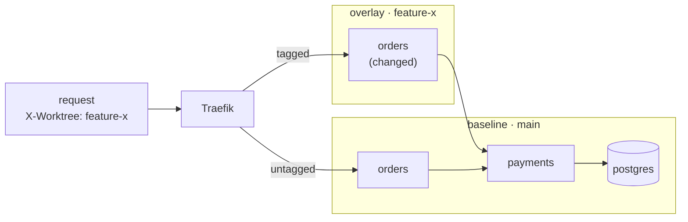

# Bopper: Copy-on-Write Docker Compose for Git Worktrees

## Summary

Running the same Docker Compose stack across several git worktrees means duplicating the whole stack per worktree, even when a branch changes one service. The proposal is to apply copy-on-write at every layer: reflinked working directories, content-addressed detection of changed services, overlays on a shared baseline stack, and cloned databases. Each worktree then pays only for what it changed. The working name is Bopper, with a bop CLI.

The same primitives extend beyond local development into cheap preview environments, zero-downtime deploys and data branching. Together they could make a single Compose file a k3s-like single-node platform.

## The problem

Git worktrees make it cheap to have several branches checked out at once, but running the application stack for each one is not cheap. With Docker Compose today, every worktree that needs a running app starts a full copy of the stack: every service, database, cache and queue.

That is wasteful because most branches change one or two services. The rest of each copy is identical to what is already running for `main`. The cost shows up as startup time, memory and CPU on the laptop, and as friction that discourages running more than one or two stacks at a time.

The goal is to run one full stack and let each worktree deploy only the containers it actually changed, with everything else falling through to the shared baseline.

## Where duplication hurts

Most worktree pain comes from copying something, whether files, containers or data. The table groups the recurring problems by layer.

| Layer          | Problem                                             | Symptom                                                |
| -------------- | --------------------------------------------------- | ------------------------------------------------------ |
| Network        | Hard-coded host ports                               | Second stack fails to start with port conflicts        |
| Containers     | Shared container, network and volume names          | Stacks overwrite each other when project names collide |
| Data           | One database per stack, seeded from scratch         | Slow setup; realistic data is expensive to copy        |
| Data           | Shared database across worktrees                    | Migrations on one branch break the others              |
| Dependencies   | `node_modules`, virtualenvs, `target/` per worktree | Minutes of install and build time, gigabytes of disk   |
| Build caches   | Cache keys include the absolute checkout path       | Cold builds even when almost nothing changed           |
| Files          | `.env`, local config and seed data are untracked    | New worktree fails in confusing ways                   |
| Git            | `.git` is a file in linked worktrees                | `git` fails inside containers that mount the worktree  |
| Git            | Stash, hooks and config are shared                  | Surprises when state leaks between worktrees           |
| External state | Caches, volumes and cookies outside the checkout    | Cross-contamination between branches                   |
| Cleanup        | Stale worktrees and their containers                | Disk and memory slowly fill up                         |

## Existing approaches and their limits

No open-source tool known to us does baseline-plus-overlay on local Compose. Existing tools either isolate full stacks or assume Kubernetes.

| Approach                                          | What it gives                                          | Limit                                             |
| ------------------------------------------------- | ------------------------------------------------------ | ------------------------------------------------- |
| Compose with per-worktree `.env` and port offsets | Isolated stacks with no new tools                      | Still a full stack per worktree                   |
| Shared Traefik with hostname routing              | No port conflicts; `feature-x.localhost` per worktree  | Still a full stack per worktree                   |
| devenv (Nix)                                      | Native services with per-directory state               | Full duplication; ports still need parameterizing |
| Dev Containers / DevPod                           | Fully isolated environment per worktree                | Heaviest option                                   |
| Tilt or Skaffold with namespaces                  | Clean isolation on a local cluster                     | Requires Kubernetes; full stack per namespace     |
| mirrord / Telepresence                            | Header-based routing of one service to a local process | Kubernetes only                                   |
| container-use (Dagger)                            | Container plus branch per parallel agent               | Isolated environments, not shared baselines       |
| Garden                                            | Skips unchanged modules by source hash                 | Heavy model; no overlay routing                   |

The gap is the combination: Compose as the input, a shared baseline, and overlays containing only what changed.

## Proposed approach: copy-on-write at every layer

Each layer shares by default and copies only on change. Four mechanisms do this.

Two things trigger a copy, and nothing else: a change that would corrupt the shared resource for everyone else, and an explicit request. Anything a branch merely reads stays shared, so an overlay starts warm instead of empty.

1. **Filesystem: reflinks.** Clone the main worktree's directory with `cp -c` (APFS) or `cp --reflink=always` (btrfs, XFS). Dependencies, build outputs and untracked files come along instantly and use no extra disk until modified. Cloning sources too, then letting `git restore` rewrite only differing files, keeps original mtimes so incremental builds stay warm.
2. **Change detection: input hashing.** Hash each service's build inputs: the files in its build context, its Dockerfile, its build args, its base image digest and its resolved Compose fragment. Compare that hash with the baseline's. Equal means reuse the baseline; different means build the service and deploy an overlay. Input hashes catch indirect changes such as shared libraries, base images and lockfiles that a path-based `git diff` misses. They also stay stable when a rebuild changes only timestamps, which final image digests do not, and they need no build to decide what to build.
3. **Services: baseline plus overlays.** One full stack runs from `main`. Each worktree starts only its changed services, joined to the baseline network. A shared Traefik routes requests carrying `X-Worktree: feature-x` to overlay containers and everything else to the baseline.
4. **Data: shared and read-only until the branch needs to write.** A worktree connects to the baseline database through a read-only role, which is what most branches want: real data, no setup, no wait. A read-only grant makes the sharing provably safe, with no proxy and no parser, so one worktree cannot corrupt another's data by accident. A worktree gets its own database in two cases: its migrations differ from the baseline's, or it declares that it writes. The clone comes from a seeded template (`CREATE DATABASE … TEMPLATE`, a full file copy of an idle template database) or from a ZFS or btrfs snapshot (true copy-on-write, and near-free). Both directions stay overridable: force a clone when you want to throw data away freely, or force shared writes when you accept the risk.

Traefik sends the tagged request to the changed `orders` in the overlay. That overlay then falls back to the baseline for `payments`, which the branch did not change.

## Architecture: two layers with a narrow boundary

The tool builds on both git and Docker, but git stays out of the core. A workspace layer handles git and the filesystem; an environment layer handles containers and never calls git.

|           | Workspace layer                                                                    | Environment layer                                                                 |
| --------- | ---------------------------------------------------------------------------------- | --------------------------------------------------------------------------------- |
| Built on  | git (or any VCS) and the filesystem                                                | Compose spec and the Docker API                                                   |
| On create | Add worktree, reflink-clone the working directory, patch `.env` and absolute paths | Compare input hashes, build changed services, start overlays, register routes, clone databases |
| On remove | Remove worktree, prune metadata                                                    | Stop overlays, drop routes, drop database clones                                  |
| Output    | A workspace ID and a directory                                                     | A running environment at `<id>.localhost`                                         |

The interface between them is just a workspace ID and a directory. That keeps the environment layer usable with jj, plain directories and CI checkouts, and lets each half be tested alone.

Targeting the Compose spec and Docker API, rather than Docker internals, gives Podman compatibility through its Docker-compatible socket. A Kubernetes backend could later sit behind the same environment interface, using mirrord-style routing.

## Automatic cleanup

Bopper should reclaim idle containers, volumes and database clones itself, so nobody needs to run `docker system prune`. Docker can't do this well: it records no last-access time for volumes, doesn't know which resources belong together, and its only automatic cleanup is BuildKit's build-cache garbage collection.

| Docker today                               | Limit                                                         |
| ------------------------------------------ | ------------------------------------------------------------- |
| `builder.gc` in `daemon.json`              | Covers build cache only                                       |
| `docker system prune --filter "until=72h"` | Creation time, not last use; `until` doesn't apply to volumes |
| `docker volume prune`                      | Removes unreferenced volumes, with no notion of age           |
| `--rm`                                     | Only for one-off containers                                   |

Bopper knows each workspace's lifecycle, so it can clean up precisely:

- **Scoped by label.** Every overlay container, volume and database clone carries `bopper.workspace=<id>`. Cleanup touches only these, never the baseline or other projects.
- **Workspace signals.** Worktree removed, branch merged or deleted, and last `bop up` are stronger reasons to delete than elapsed time.
- **Real access time.** Traefik access logs record the last request routed to each workspace.
- **Tiered policy.** Stop idle overlays after a few hours, freeing memory but keeping data. Delete volumes and database clones only once the worktree is gone or idle for days.
- **Wake on request.** Sablier, an open-source tool, stops containers after inactivity and restarts them when a request arrives through Traefik; it may fit the routing layer directly.
- **Snapshot before delete.** With copy-on-write volumes a final snapshot costs almost nothing, so an over-eager policy stays recoverable.

This matters more for preview environments, where abandoned PR environments are a recurring cost.

## Hard edges

HTTP routing is roughly a day of work. Most of the real effort sits in the cases below.

| Edge                       | Why it breaks                                                                                             | Mitigation                                                                       |
| -------------------------- | --------------------------------------------------------------------------------------------------------- | -------------------------------------------------------------------------------- |
| Header propagation         | A baseline service that doesn't forward `X-Worktree` sends the request to the baseline version downstream | OpenTelemetry baggage; without it, offer the no-routing mode only                |
| Schema changes             | A differing migration can't run against the shared database without breaking every other worktree         | Clone the database for that worktree only, and route it to that worktree's services |
| Queues and async consumers | A second copy of a consumer competes with the baseline one and steals its messages                        | Run no consumer in the overlay by default; on request, give it its own queue or a routing attribute to filter on |
| Caches and scheduled jobs  | A branch that changes a cached value's shape poisons the shared key; a duplicated cron worker doubles its work | Share keys by default, and prefix them with the workspace ID on request; run no scheduled worker in the overlay |
| Uncaptured build inputs    | A build that fetches an unpinned dependency changes behaviour while every hashed input stays equal         | Require lockfiles in the build context; pin base images by digest                |
| Absolute paths             | Reflinked venv shebangs and `compile_commands.json` point at the original checkout                        | Recreate venvs from cache; regenerate path-bearing files                         |
| mtime-based builds         | Fresh checkouts make every source look newer than its outputs                                             | Clone sources too; let `git restore` rewrite only differing files                |
| Unreachable changes        | A changed service that no tagged request reaches, such as one called only by a job                        | Trigger it directly                                                              |

## MVP scope

The first version skips header routing entirely. It already covers the common case where the changed service sits at the edge of the call graph.

1. **`bop up`:** create the worktree, reflink-clone the working directory and ignored artifacts, patch `.env` with the workspace ID and hostname. The database entry stays as it is, and points at the baseline, unless the branch earns a clone.
2. **Change detection:** hash each service's build inputs and compare with the baseline. Build only the services whose hash differs.
3. **Partial stack:** start only the changed services on the baseline network, pointed at baseline hostnames for everything else, reachable at `<id>.localhost` through a shared Traefik.
4. **`bop down`:** stop overlays, drop any database clone, remove the worktree and prune. A shared baseline database is never touched.

Header-based routing and propagation come second, once a baseline service needs to call an overlay.

See [roadmap.md](roadmap.md) for the build phases, their exit tests and the open questions that block them. It adds a phase 0 ahead of this scope: two spikes and a measured baseline, which answer the naming and filesystem questions by hand before any code depends on them.

## Productising: Compose as a single-node platform

The same primitives can turn an unchanged Compose file into a k3s-like platform for single servers. Compose describes a stack well but stops at starting containers; teams move to Kubernetes for the operational layer, not because they need many nodes.

### What Kubernetes adds that Compose lacks

| Capability                       | k3s                                | Compose today                        | Proposed                                                              |
| -------------------------------- | ---------------------------------- | ------------------------------------ | --------------------------------------------------------------------- |
| Desired state and reconciliation | Controllers continuously reconcile | Runs once on `up`                    | Agent reconciles a Compose file from git; reports drift               |
| Rolling, zero-downtime deploys   | Built in                           | Recreates containers, brief downtime | Start new version as an overlay, shift traffic, keep old for rollback |
| Traffic routing and canaries     | Ingress, service mesh              | None                                 | Header-routed overlays, including test-in-production                  |
| Per-change environments          | Namespaces, heavy per copy         | Full stack per copy                  | Overlays on a shared baseline                                         |
| Stateful data management         | Volume snapshots via CSI           | None                                 | Pre-deploy snapshots, database branching, masked prod clones          |
| API and packaging                | API server, Helm                   | CLI; Compose apps as OCI artifacts   | Control-plane API over Compose files                                  |

### Product ideas, in order of leverage

1. **Cheap preview environments.** One VM runs a staging baseline plus many PR overlays at `pr-123.preview.example.com`. This is the strongest wedge: the same core as the local tool, and teams have budget for it.
2. **Zero-downtime deploys with instant rollback.** Input-hash comparison touches only services that changed; the previous version stays running until traffic has moved.
3. **Copy-on-write data management.** Automatic volume snapshots before each deploy, so a bad migration rolls back with the code, plus per-preview database branches. Most tools in this space ignore state, which makes this the likeliest moat.
4. **A lazy database clone, triggered by the first write.** A protocol-aware proxy such as pgcat or ProxySQL sits in front of the baseline database, watches for the first statement that writes, clones at that moment and redirects the worktree. This is true copy-on-write for data, decided by real use instead of by a guess up front. Three problems gate it. An open transaction cannot move to a fresh database. Session state, such as temp tables, prepared statements and `search_path`, does not survive the switch. A `TEMPLATE` copy takes seconds to minutes and stalls the statement that triggered it, so only a snapshot-backed clone is fast enough. Note that Traefik cannot do this: its TCP router matches on SNI alone, reads no database protocol beyond the Postgres `SSLRequest` handshake, and therefore never sees a statement.
5. **A reconciling control plane.** GitOps for Compose, in the spirit of Argo CD or Flux, with drift detection and an API.
6. **One definition from laptop to production.** The same Compose file runs locally, in previews and in production, with environment differences expressed as small overlays.

### Landscape

Kamal does zero-downtime container deploys over SSH. Dokku, Coolify, CapRover and Dokploy are self-hosted PaaS tools centred on apps rather than stacks. Portainer and Komodo provide management UIs, and Swarm is largely stagnant. None treat the Compose file as the unit with overlay semantics, as far as we know; this space moves quickly and should be rechecked.

### Risks

- **Header propagation** limits the routing features to teams with tracing in place; partial stacks without routing must remain a first-class mode.
- **Single node means no high availability.** A clear answer is needed for teams that outgrow one server, such as exporting to Kubernetes.
- **Docker owns the platform** and keeps extending Compose. Building on the spec and API, not internals, limits the exposure.
- **The PaaS end is crowded.** “Your existing Compose file, made operational” is a sharper position than another self-hosted Heroku.

### Sequencing

Open-source the local tool to build developer adoption. Sell preview environments as the first paid team product. Production deploys, data management and the control plane follow, with data features as the main differentiator.
